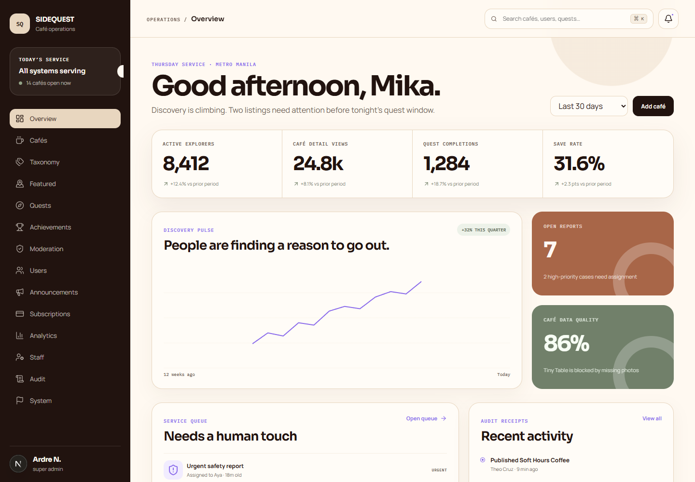
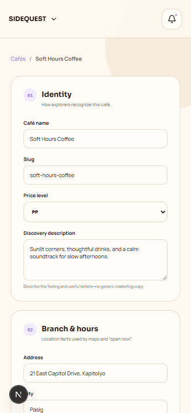
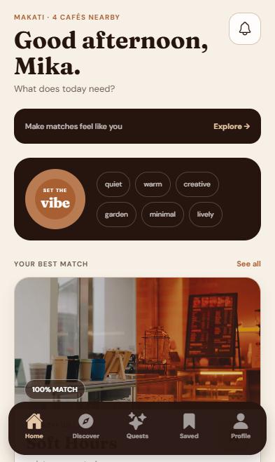

# SIDEQUEST

SIDEQUEST is a Gen Z café-discovery product built around vibe, budget, use case, and real-world challenges. This repository ships a native Expo app, a zero-install web consumer, and a responsive admin platform backed by a production-minded Supabase foundation.

## Start

```powershell
cd "D:\INFORMATION TECHNOLOGY\SIDEQUEST"
npm --prefix packages/shared ci
npm --prefix apps/admin ci
npm --prefix apps/mobile ci
npm run dev
```

Then open:

- Consumer app: `http://localhost:3000/app`
- Admin platform: `http://localhost:3000/overview`

Start the native application separately with:

```powershell
npm run mobile
```

Scan the QR code with Expo Go, or run `npm run mobile:android` with an Android emulator.

## What is included

- Native Expo/React Native application for Android and iOS, plus a zero-install web consumer
- Café-themed responsive admin UI with reusable design tokens and components
- Mobile-first onboarding, vibe discovery, budget filters, map/list browsing, and café details with real bundled photography
- Saved cafés and collections, reviews and vibe tags, quests with XP, friends, profile, achievements, settings, and Plus
- Persistent local demo state for a complete no-credentials product walkthrough
- Cafés, branches, hours, photos, vibes, taxonomy, and featured placement operations
- Quest builder, immutable versions, achievements, and append-only XP adjustments
- Moderation queue, private evidence, appeals foundation, users, and sanctions
- Announcements, entitlements, staff access, immutable audit, system health, and analytics
- Four-role capability model, Supabase Auth gate, RLS policies, seeded demo data, and automated tests

## Product and design deliverables

- [Complete capstone product package](docs/SIDEQUEST_PRODUCT_PACKAGE.md)
- [Admin setup and deployment guide](apps/admin/README.md)
- [Native Expo setup and build guide](apps/mobile/README.md)
- [Admin product/design specification](docs/superpowers/specs/2026-08-27-sidequest-admin-design.md)
- [Native mobile specification](docs/superpowers/specs/2026-08-27-sidequest-native-mobile-design.md)
- [Native mobile implementation plan](docs/superpowers/plans/2026-08-27-sidequest-native-mobile-implementation.md)
- [Editable Figma product file](https://www.figma.com/design/gC1tMqwxJ0YKzavpPwflJZ)

The Figma file includes the café-themed token library, reusable component states, six admin views, twenty mobile consumer screens, empty/loading/error states, and a wired primary prototype flow. The repository implements the matching consumer and admin experiences. Consumer data runs in persistent demo mode until a user-owned Supabase project and external providers are connected.

## Preview






